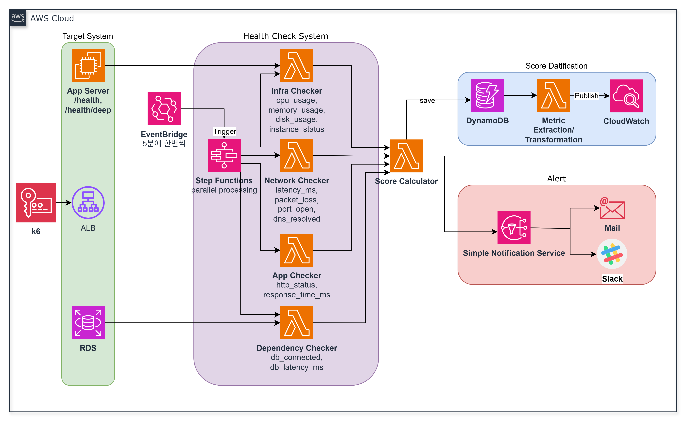
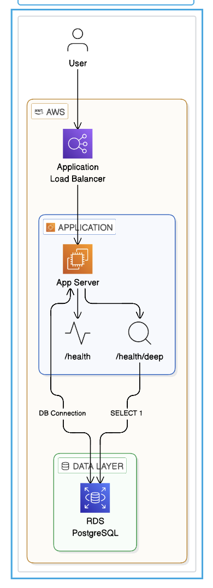

# 시스템 아키텍처 (다이어그램)

두 장면 다이어그램이 각각 어떤 경계를 나타내는지와 흐름만 정리합니다.

---

## 1. 멀티 레이어 헬스체크 파이프라인

**보는 관점:** VPC 안에서 동작하는 **헬스체크 엔진**—대상 앱을 직접 프로빙하고 점수화·저장·관측·알림까지 이어지는 경로.

**흐름 요약**

- **스케줄**: EventBridge가 일정 주기로 오케스트레이션을 트리거합니다.
- **병렬 점검**: Step Functions가 Infra·Network·App·Dependency 네 갈래 Checker Lambda를 동시에 돌립니다. 각 Checker가 다루는 구체적 메트릭·프로브 종류는 상기 다이어그램의 라벨(cpu_usage, latency_ms, `http_status`, `db_connected` 등)을 따릅니다.
- **집계**: Score Calculator Lambda가 네 결과를 받아 통합 스코어를 계산합니다.
- **저장·관측**: 결과는 DynamoDB에 적재되고, 별도 Lambda가 데이터를 가공해 CloudWatch로 메트릭을 발행합니다(대시보드·추세 분석의 입력).
- **알림**: Score Calculator 쪽 판정에 따라 SNS가 발화하고, 메일·Slack 등으로 전달됩니다.

레이어 이름, 가중치, 점수 구간별 판정·Override 규칙은 README 본문의 표와 동일합니다.

---

## 2. 대상 애플리케이션 스택

**보는 관점:** 헬스체크 **대상이 되는 최소 서비스**—트래픽이 들어와 ALB를 거쳐 Express 앱과 RDS로 이어지는 구조와, 헬스 엔드포인트가 DB에 닿는 범위를 구분해 보여 줍니다.

### 앱 서버 구성

- **Node.js + Express 앱 (이미지: `node:20-alpine`)**
- 최소 구성
  - **EC2 또는 ECS에 Express 앱 1개**
  - **ALB 앞단**
  - **RDS PostgreSQL 1개**
- 최소 엔드포인트
  - `GET /` — 단순 200, 서비스 생존 확인용
  - `GET /health` — **프로세스만** 확인, DB 미연동, 거의 즉시 200
  - `GET /health/deep` — DB 연결 확인(`SELECT 1`), 응답 시간 포함
  - `GET /api/test` — 일반 비즈니스 API 흉내, DB 조회 1회, **k6 부하 테스트 대상**

다이어그램상 **얕은 헬스**는 앱 내부에서만 닫히고, **깊은 헬스**와 비즈니스 DB 접근은 RDS로 이어지는 점이 시각적으로 구분됩니다.

---

## 두 다이어그램의 관계

- **2번(대상 스택)**: 실제 사용자·k6·ALB 경로와 앱/RDS 경계—_무엇을 지키는 대상인지_.
- **1번(파이프라인)**: 그 대상과 인프라를 **주기적으로 프로빙하고** 점수·알림·메트릭으로 만드는 쪽—_어떻게 관측하는지_.

같은 AWS Cloud 안에서 2번이 “피감시 워크로드”, 1번이 “감시·집계·전달”에 해당합니다.
